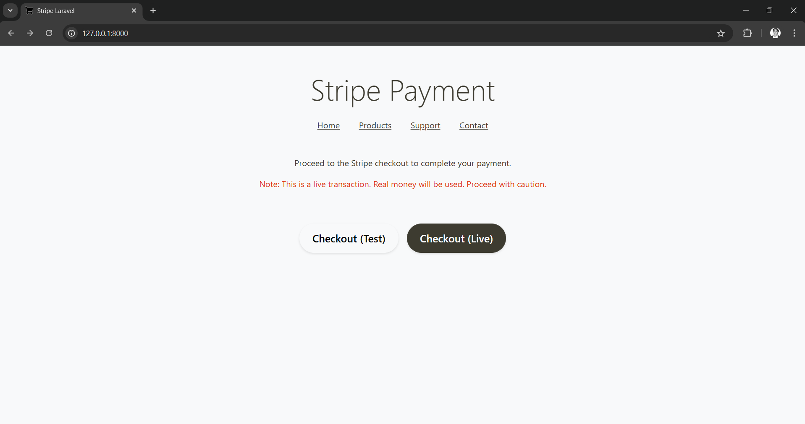

# Stripe Payment Demo
A demo application for integrating Stripe payments using the Laravel web framework.




## Requirements
- PHP v8.0
- Composer v2.4.1
- Web Server (HTTPS)

## Setup
```bash
laravel new stripe-laravel
cd stripe-laravel
composer require stripe/stripe-php
```

## Code
- app/Http/Controllers/StripeController.php
- config/stripe.php
- routes/web.php
- resources/views/checkout.blade.php
- resources/views/layout.blade.php
- resources/views/success.blade.php

## Env
Copy `.env.example` to `.env` and populate the following API keys:

```env
STRIPE_TEST_SK=your_test_secret_key
STRIPE_TEST_PK=your_test_publishable_key

STRIPE_LIVE_SK=your_live_secret_key
STRIPE_LIVE_PK=your_live_publishable_key
```

## Deploy
Deploy via SFTP (Secure File Transfer Protocol) to your preferred hosting provider, ensuring the server supports HTTPS.
